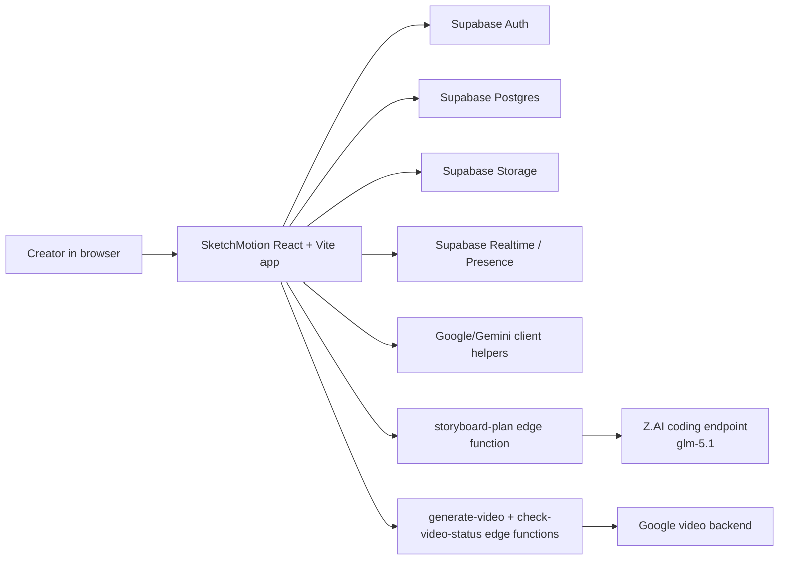

# SketchMotion

SketchMotion is a collaborative storyboard workspace for turning rough visual frames into a motion-ready plan. Teams can sketch scenes, organize boards, persist frames in Supabase, collaborate in real time, and now run a judged GLM-powered storyboard workflow that analyzes saved frames, proposes shots, surfaces continuity rules, and supports one-click revision passes.

## Product Description

SketchMotion helps creative teams move from storyboard frames to a production plan without leaving the canvas.

- Create and organize storyboard boards and frames
- Save sketches and polished frames to Supabase storage
- Collaborate on the same board with realtime presence and interaction cues
- Use AI helpers for sketch polish, prompt generation, and storyboard planning
- Run a staged GLM workflow inside the existing AI panel without changing the core editing experience

## Target User

SketchMotion is designed for:

- Creative directors shaping a storyboard before production
- Motion designers planning shots, pacing, and continuity
- Founders and marketers turning campaign ideas into a clear visual sequence
- Small creative teams who need a shared storyboard workspace, not a full editing suite

## What Works Today

- Supabase auth and board persistence
- Frame CRUD, ordering, and storage-backed image assets
- Realtime collaboration and presence flows
- Existing Google/Gemini-powered sketch and prompt helpers
- Existing Google-backed video-generation path through Supabase edge functions
- New Z.AI / GLM storyboard planning workflow in the AI panel when `VITE_AI_PROVIDER=zai`

## Architecture



### Runtime Notes

- The main product stays client-driven for board editing, collaboration, and the current Google/Gemini workflow.
- The judged GLM path is server-side for secrets safety.
- The judged GLM path is metadata-first and does not require live frame image fetches.
- Google remains the default provider unless `VITE_AI_PROVIDER=zai` is set.

## How We Use GLM 5.1

The judged workflow is intentionally centered on one reliable model path:

1. `glm-5.1` runs on the Z.AI coding endpoint and reads ordered frame titles, frame order, durations, motion notes, selected frame IDs, and Director Controls.
2. That single coding-endpoint run produces the storyboard analysis, shot plan, continuity rules, render strategy, and revision-aware reasoning.
3. The result is returned to the existing AI panel as readable sections instead of raw JSON by default.
4. A follow-up revision can reuse the previous plan and ask `glm-5.1` for a tighter pass without changing the board structure.

### Why This Matters

- Secrets stay off the client.
- The main demo path no longer depends on the general multimodal endpoint or separate image-fetch credits.
- The workflow is easy to demo and easy to extend later for image or video orchestration if we want that after the hackathon.
- The current Google/Gemini product path remains intact while the judged GLM path is feature-flagged.

## Live Demo Path

This is the narrow path we optimized for the submission demo:

1. Start the app with `VITE_AI_PROVIDER=zai`.
2. Make sure the `storyboard-plan` edge function is deployed with the Z.AI server secrets listed below.
3. Sign in and open an existing board as the board owner.
4. Open the AI panel and use the existing Director Controls if you want to steer mood, camera language, pacing, lighting, continuity, or avoid-list constraints.
5. Click `Run Director Plan`.
6. Review the returned `Storyboard Analysis`, `Shot Plan`, `Continuity Rules`, and `Render Strategy`.
7. Enter one concise revision in `Revision Input`.
8. Click `Apply Revision` to demonstrate the revision loop.

## Setup

### Client Environment

Create a local `.env` file with:

```bash
VITE_SUPABASE_URL=your_supabase_url
VITE_SUPABASE_ANON_KEY=your_supabase_anon_key
VITE_GEMINI_API_KEY=your_gemini_api_key
VITE_AI_PROVIDER=google
```

Use `VITE_AI_PROVIDER=zai` when you want the new judged GLM workflow enabled in the UI.

### Server Environment For `storyboard-plan`

Configure these as Supabase edge-function secrets:

```bash
STORYBOARD_AI_PROVIDER=zai
ZAI_API_KEY=your_zai_api_key
ZAI_CODING_API_BASE_URL=https://api.z.ai/api/coding/paas/v4
ZAI_GLM_PLANNING_MODEL=glm-5.1
ZAI_THINKING_TYPE=enabled
```

Optional legacy / experimental env vars are still supported for older experiments, but they are not the judged path:

```bash
ZAI_GENERAL_API_BASE_URL=https://api.z.ai/api/paas/v4
ZAI_GLM_VISION_MODEL=GLM-5V-Turbo
ZAI_API_BASE_URL=https://api.z.ai/api/paas/v4
ZAI_GLM_STORYBOARD_MODEL=glm-4.6v
```

### Server Environment For Video Generation

The current video-generation edge functions expect Google-side server configuration:

```bash
GOOGLE_CLOUD_PROJECT=your_project_id
GOOGLE_CLOUD_LOCATION=us-central1
GOOGLE_CLOUD_BUCKET_NAME=your_bucket_if_used
GOOGLE_SERVICE_ACCOUNT_KEY=your_service_account_json_or_base64
```

### Run Locally

```bash
npm install
npm run dev
```

If you use Supabase locally or in a hosted project, deploy the relevant edge functions before testing the full AI flow.

## Judged Workflow Output

The GLM workflow returns structured data with:

- Frame-by-frame analysis
- Scene and shot planning
- Continuity constraints
- Render strategy guidance
- Revision context for the next pass
- Model and endpoint metadata for transparent reporting

## Known Limitations

- The judged GLM workflow is metadata-first. It does not require remote image URLs, but richer frame notes still improve output quality.
- Google remains the default provider. Changing to `VITE_AI_PROVIDER=zai` requires restarting the app.
- The GLM path currently plans and revises the storyboard; it does not yet trigger final video generation automatically.
- The current video generation path is still separate from the judged GLM workflow and uses the existing Google-backed video functions.
- The current video path anchors generation from a single frame image rather than a full multi-frame render plan.
- The Kestra director block is still demo-oriented and depends on stored external results.
- Some legacy setup details, such as older schema history and certain demo-oriented tables, are not fully represented in the checked-in migrations.

## Submission Notes

SketchMotion is strongest when it is shown as a collaborative storyboard workspace with a visible, believable GLM planning loop:

- Open a real board
- Run the GLM storyboard workflow
- Show the structured plan
- Apply one revision

That is the clearest representation of the product today and the safest path for a live demo.
